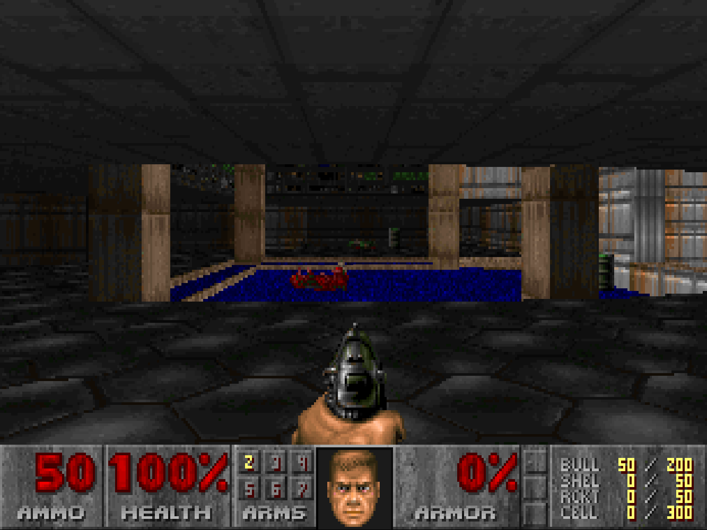
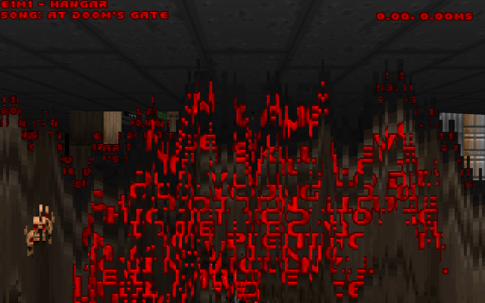
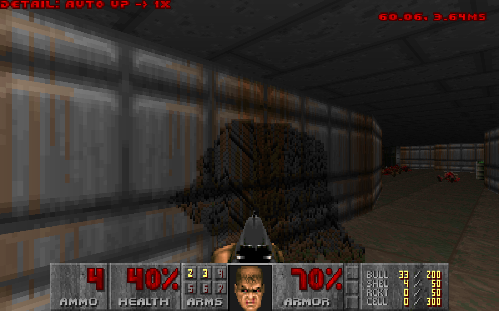
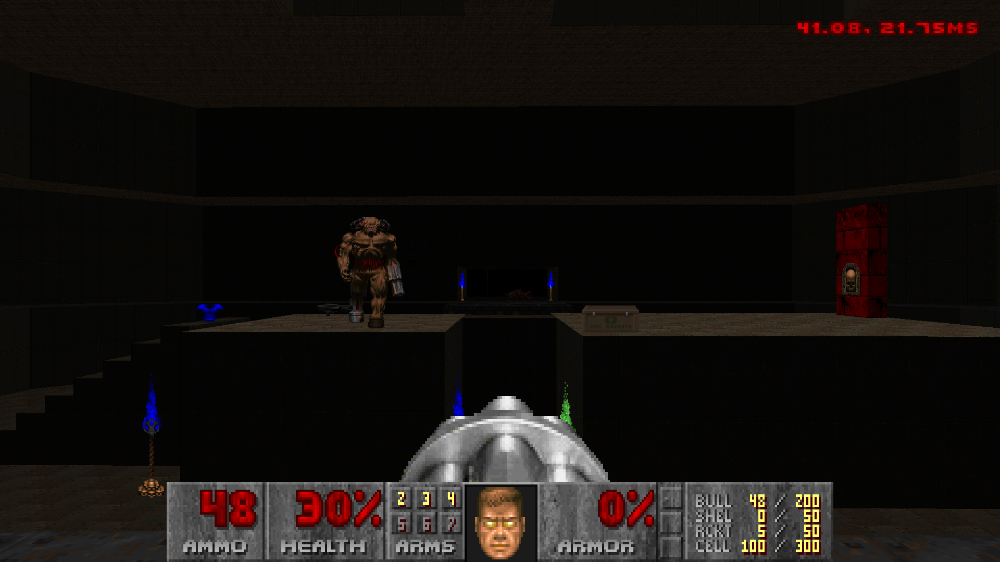
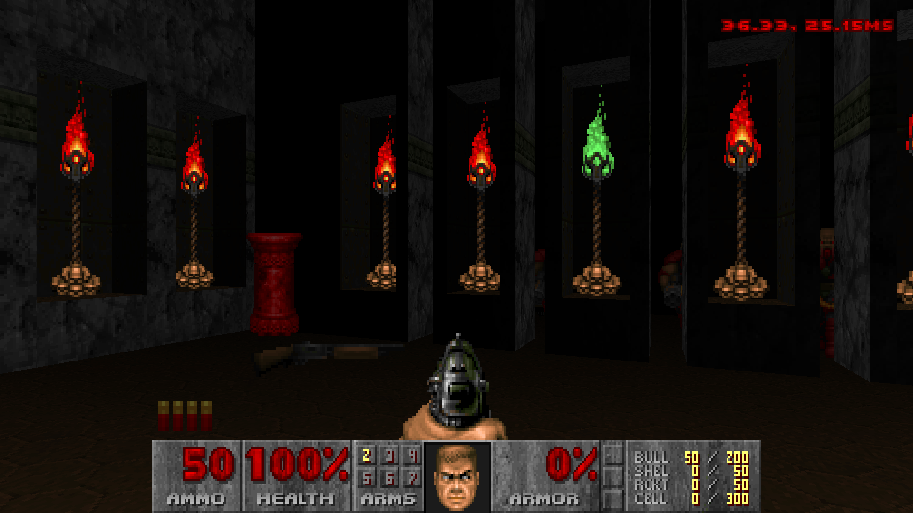
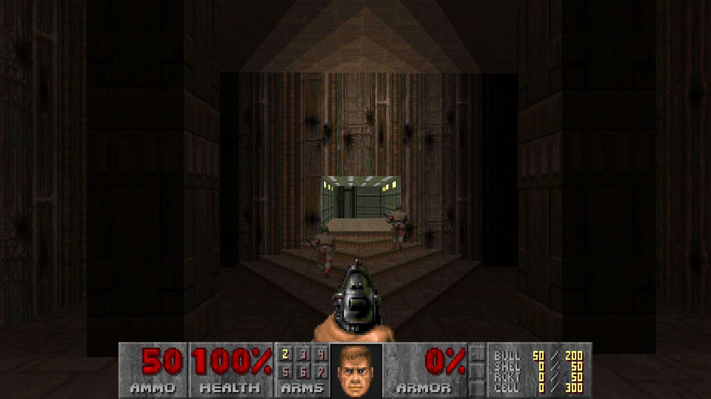

# GD-DOOM
(go doom)

[](https://github.com/Distortions81/GD-DOOM/actions/workflows/ci.yml)
[](https://github.com/Distortions81/GD-DOOM/actions/workflows/govulncheck.yml)
[](https://github.com/Distortions81/GD-DOOM/releases/latest)
[](https://github.com/Distortions81/GD-DOOM/blob/main/LICENSE)

<p align="center">
  
  <br>
  Source Port mode at 3840x2160 [4k]: smoother camera motion, cleaner high-resolution rendering, 32-bit color, smoothed lighting animations, monster movement and a sharper modern presentation without losing Doom's original feel.
  <br>
  Still software rendered, not smeary GPU rendering.
</p>

<p align="center">
  
  <br>
  Faithful mode: the classic Doom look, preserved.
</p>

<p align="center">
  
  <br>
  Automap view: better suited for modern displays, with a cleaner presentation.
  <br>
  Play in browser now: <a href="https://m45sci.xyz/u/dist/GD-DOOM">https://m45sci.xyz/u/dist/GD-DOOM</a>
</p>

<p align="center">
  <a href="https://youtu.be/ID52vj9WQ8A">
    
  </a>
  <br>
  <a href="https://youtu.be/ID52vj9WQ8A">Watch on YouTube</a><br>
  E1M5: Doom's default first demo playback at game menu
  <br>
</p>

<p align="center">
  <a href="https://www.youtube.com/watch?v=tkc6Z8xcjzs">
    
  </a>
  <br>
  <a href="https://www.youtube.com/watch?v=tkc6Z8xcjzs">Watch on YouTube</a><br>
  E1M1
  <br>
</p>

<p align="center">
  <a href="https://www.youtube.com/watch?v=aINCe9459-U">
    
  </a>
  <br>
  <a href="https://www.youtube.com/watch?v=aINCe9459-U">Watch on YouTube</a><br>
  Slow-motion look at how GD-DOOM renders in software, in the spirit of the original DOOM renderer.
  <br>
</p>

<p align="center">
  <a href="https://www.youtube.com/watch?v=vT9SldgjbeA">
    
  </a>
  <br>
  <a href="https://www.youtube.com/watch?v=vT9SldgjbeA">Watch on YouTube</a><br>
  PC-speaker emulation demo: GD-DOOM running with classic PC-speaker style audio.
  <br>Including music, which original Doom did not support!
  <br>Fully simulates the open air 2.2" 8-ohm paper speaker, driven with ~4v through 33-ohm resistor with steel pc case reverb.
  <br>
</p>

<p align="center">
  
  
  <br>
  Classic Doom effects kept intact at higher resolutions, including the screen melt transition and the signature invisibility fuzz effect.
</p>

<p align="center">
  
  
  
  <br>
  Gameplay screenshots from different areas. Correct DOS gamma, colors and aspect ratio.
</p>

GD-DOOM is a Doom engine and source port for original Doom data. It runs on desktop and in the browser, loads base game WADs plus add-ons, plays and records classic Doom demos, and adds live watch, chat, and voice features on top.

GD-DOOM is distributed under GNU GPL v2. It is inspired by, ported from, and derivative of id Software's DOOM source release. See [LICENSE](/home/dist/github/GD-DOOM/LICENSE) and [NOTICE](/home/dist/github/GD-DOOM/NOTICE).

## Compared With Vanilla Doom

Note: Not all features are exposed in the UI, some are still experimental.

GD-DOOM still uses original Doom WAD data and Doom-style game logic, but it is built to feel better on modern hardware. The biggest differences are:

- Two presentation styles: play in `Faithful` mode for a more classic look, or `Source Port` mode for smoother motion and a cleaner modern image.
- Smoother gameplay: movement, turning, weapon animation, and monster motion are interpolated so the game does not feel locked to visible tic steps.
- Cleaner rendering: full-color output, better HUD scaling, and modern-display-friendly automap presentation.
- Classic effects preserved: the melt transition and invisibility fuzz effect are kept recognizable even at high resolutions.
- Better controls: mouse look, flexible bindings, in-game key setup, and browser touch controls are built in.
- Better save and demo support: normal saves, quicksave, unlimited save slots, classic demo playback/recording, and optional tick-by-tick trace export.
- More audio options: FM-style adlib/sb16 music, SoundFont MIDI playback, PC speaker emulation, and Linux hardware PC speaker output.
- Live watch features: one player can broadcast while others watch, chat, and listen or talk over voice in real time.
- Browser play: the same project also runs in the browser with local WAD loading and persistent web saves.

## Requirements

- Go `1.26.1` or newer from [golang.org](https://go.dev/dl/)
- A Doom game WAD such as `DOOM.WAD`, `DOOM1.WAD`, `DOOM2.WAD`, `TNT.WAD`, or `PLUTONIA.WAD`

On Linux, native builds also need the usual Ebiten desktop dependencies for X11, OpenGL, and audio.

On Debian/Ubuntu, a typical setup is:

```bash
sudo apt update
sudo apt install -y \
  build-essential pkg-config \
  libasound2-dev libpulse-dev \
  libx11-dev libxcursor-dev libxinerama-dev libxrandr-dev libxi-dev \
  libgl1-mesa-dev libxxf86vm-dev
```

## Quick Start

Run from the repository root:

```bash
go run . -wad DOOM1.WAD
```

The dedicated desktop entrypoint is equivalent:

```bash
go run ./cmd/gddoom -wad DOOM1.WAD
```

You can also pass the base game WAD as the first positional argument:

```bash
go run . DOOM1.WAD
```

Add-on/mod WADs are comma-separated:

```bash
go run . -wad DOOM2.WAD -file mods/nerve.wad,mods/examplepatch.wad
```

If `-wad` is omitted and the working directory contains one known game WAD, GD-DOOM uses it automatically. If multiple supported game WADs are present, the runtime can open an in-game picker.

`-file` add-ons are layered on top of the chosen base game. If you want demo playback, watching, or live sessions to match correctly, every machine should use the same base game and the same mod files.

## Common Options

Print all flags:

```bash
go run . -help
```

Frequently used options:

- `-sourceport-mode` starts in the smoother, higher-fidelity Source Port profile.
- `-pc-speaker` switches sound effects to the PC speaker emulation path.
- `-pc-speaker-hw` (Linux only) routes PC speaker output to the real hardware buzzer device instead of the audio card. This uses the `pcspkr` evdev node and requires write permission to it.
- `-pc-speaker-interleave-hz=N` sets the rate (in Hz) at which the speaker switches between SFX and music when both are active (default 140, which matches one Doom tic; range 10–1000).
- `-music-backend=auto|impsynth|meltysynth` selects the music style/engine.
- `-soundfont=PATH` selects an external `.sf2` file for `meltysynth`.
- `-detail-level=N` sets starting image detail and `-auto-detail` tries to keep the game near 60 FPS automatically.
- `-no-monsters` disables monster spawns.
- `-crt-effect` and `-texture-anim-crossfade-frames=N` enable extra visual polish in Source Port mode.
- `-map=E1M1` or `-map=MAP01` starts on a specific map.
- `-record-demo=out.lmp` records a Doom v1.10 demo from live play.
- `-demo=path/to/demo.lmp` plays back a Doom v1.10 demo and exits when playback ends.
- `-trace-demo-state=path.jsonl` writes a detailed tick-by-tick state log during demo playback.
- `-broadcast[=ADDR]` starts a live session for watchers, defaulting to `127.0.0.1:6670`.
- `-watch[=ADDR] -watch-session=N` joins a relay session as a viewer.
- `-low-latency` trades some efficiency for faster live delivery.
- `-mic` sends microphone audio while broadcasting.
- `-mic-codec=silk|g726|pcm` selects the voice codec used for microphone streaming.
- `-config=config.toml` reads and persists native runtime settings.
- `-dump-music` saves the game's music tracks as WAV files.
  Note: the main app dump path currently exports the built-in OPL/SoundFont renderers, while `cmd/musicwav` and `scripts/dump_music.sh` support direct PC speaker WAV export modes.

There are more flags than the short list above. Use `go run . -help` for the full set if you want every tweak and debug option.

Aspect correction note:
In faithful mode, GD-DOOM applies Doom's classic 4:3 correction as a whole-screen stretch after rendering. In Source Port mode, it applies that correction during rendering. A small set of sprites that are meant to read as circular, such as pickups and fireballs, are kept round instead of being stretched.

Examples:

```bash
go run . -wad DOOM1.WAD -sourceport-mode
go run . -wad DOOM1.WAD -pc-speaker
go run . -wad DOOM1.WAD -music-backend=impsynth
go run . -wad DOOM1.WAD -music-backend=meltysynth -soundfont=./soundfonts/general-midi.sf2
go run . -wad DOOM1.WAD -detail-level=2 -auto-detail
go run . -wad DOOM2.WAD -map=MAP01 -record-demo=output.lmp
go run . -wad DOOM1.WAD -demo=demos/DOOM1-DEMO1.lmp
go run . -wad DOOM1.WAD -dump-music
go run ./cmd/musicwav -doom2 DOOM2.WAD -song D_RUNNIN -mode pcspeaker-clean -out ./out/music-pcspeaker-clean
go run . -wad DOOM1.WAD -broadcast
go run . -wad DOOM1.WAD -broadcast -mic -mic-codec=silk
go run . -wad DOOM1.WAD -watch -watch-session=1
go run . -wad DOOM1.WAD -cheat-level=3
go run . -wad DOOM1.WAD -all-cheats
```

## Relay Watch / Voice

Run the relay server:

```bash
go run ./cmd/gdsfrelay
```

Broadcast a session to the default local relay:

```bash
go run . -wad DOOM1.WAD -broadcast
```

The broadcaster prints the assigned session id on startup. View from another instance using the same base game and mod files:

```bash
go run . -wad DOOM1.WAD -watch -watch-session=1
```

Optional voice broadcast is available on native Linux builds through PulseAudio capture:

```bash
go run . -wad DOOM1.WAD -broadcast -mic
go run . -wad DOOM1.WAD -broadcast -mic -mic-codec=silk
```

Notes:

- `-broadcast` and `-watch` are mutually exclusive.
- `-watch` also connects to the paired relay audio stream automatically.
- Watchers can also participate in session chat.
- `-low-latency` favors quicker delivery over more batching.
- Current microphone codecs are `silk`, `g726`, and `pcm`.
- The wire format is documented in [`netplay-protocol.md`](/home/dist/github/GD-DOOM/netplay-protocol.md).

This is live spectating, not traditional co-op. One machine plays, the others watch the run as it happens, with chat and optional voice alongside the stream.

## Cheats

Startup cheats:

- `-cheat-level=1` enables full automap reveal with `IDDT 2`.
- `-cheat-level=2` applies the above plus `IDFA`.
- `-cheat-level=3` applies the above plus `IDKFA` and invulnerability.
- `-invuln` starts with invulnerability enabled.
- `-all-cheats` is the alias for full startup cheats.

Typed in-game cheats:

- `iddqd` toggles invulnerability.
- `idfa` grants weapons, ammo, and armor.
- `idkfa` grants weapons, ammo, armor, and keys.
- `iddt` cycles automap reveal and thing display states.
- `idclip` toggles no-clip.
- `idspispopd` also toggles no-clip.
- `idmypos` prints the current player angle and coordinates.
- `idchoppers` grants chainsaw + invulnerability tick behavior matching classic Doom.
- `idclev##` warps to a map such as `idclev11` or `idclev23`.
- `idmus##` changes music when the current WAD supports that track selection.
- `idbehold` shows the power-up cheat prompt.
- `idbeholdv`, `idbeholds`, `idbeholdi`, `idbeholdr`, `idbeholda`, and `idbeholdl` toggle the matching power-up effect.

## Controls

Default desktop controls are:

- Menus: `Arrow Keys` + `Enter`, `Esc` to go back.
- Game: `WASD` or arrow keys to move, mouse to turn.
- Fire: `Ctrl` or left mouse button.
- Use / open: `E` or `Space`.
- Run modifier: `Shift`.
- Strafe modifier: `Alt`.
- Automap: `Tab`.
- Chat: `T`.
- Push to talk: `Caps Lock`.
- Weapon next / previous: `Page Down` / `Page Up` or mouse buttons `MB5` / `MB4`.
- Help: `F1`.

Bindings can be changed in the frontend and pause-menu keybind screens and saved in `config.toml`. There are also extra runtime shortcuts for detail level, gamma, screenshots, and automap behavior.

## Menus And Config

The frontend and pause menus expose most settings people actually want to change while playing:

- Sound options for SFX/music volume.
- Voice options for codec, sample rate, automatic gain control, gate strength, device selection, and push-to-talk.
- Key binding menus with primary/alternate bindings and reset-to-default support.
- Browser/touch-friendly frontend flow, including touch prompts on the title screen, touch controls in frontend submenus such as the music player, and touch-safe menu-close debounce.
- Persisted native settings through `config.toml`, including runtime options and the `keybinds` table.

`config.toml` is the desktop settings file. GD-DOOM reads it at startup and writes changes back when you update settings or bindings in-game. You can ignore it and use the menus, or edit it by hand.

A representative config can include entries such as:

```toml
detail_level_faithful = 0
detail_level_sourceport = 0
auto_detail = false
gamma_level = 2
mouselook = true
music_backend = "meltysynth"
soundfont = "soundfonts/general-midi.sf2"

[keybinds]
move_forward = ["W", "UP"]
chat = ["T", ""]
voice = ["CAPSLOCK", ""]
use = ["SPACE", "E"]
```

## Browser Build

GD-DOOM also has a browser version. To build it locally:

```bash
./scripts/build_wasm.sh
```

The script writes fresh browser assets, including `gddoom.wasm.gz`. It requires:

- `DOOM1.WAD` at the repository root
- `wasm_exec.js` from your local Go toolchain
- optional `wasm-opt` on `PATH` for automatic optimization (`-O4` by default, override with `WASM_OPT_LEVEL`)

Serve the generated app:

```bash
go run ./cmd/wasmserve
```

By default `cmd/wasmserve` serves the current directory if it already contains the built app; otherwise it falls back to `build/wasm` and listens on `:8000`.

You can also serve a specific output directory:

```bash
go run ./cmd/wasmserve -dir build/wasm -addr :8000
```

The browser UI can load WAD files locally from your machine, cache SoundFonts for `meltysynth`, and keep saves in browser storage. It shares most of the same runtime code as desktop builds, though some features remain platform-specific, especially microphone capture.

On browsers with strict autoplay policies, a click is required before audio starts. On touch devices, the browser build uses a dual-pad layout for movement, turning, fire, use, and menu access.

## Development

Run the test suite:

```bash
go test ./...
```

Run the slower export and real-asset integration checks explicitly:

```bash
scripts/test_integration.sh ./internal/app
```

This integration lane also includes generator-style tests that write artifacts, such as the billboard bbox dump in `internal/doomruntime`.

If you are working on the engine itself, extra utilities are included under [`cmd/`](/home/dist/github/GD-DOOM/cmd):

- [`cmd/gdsfrelay`](/home/dist/github/GD-DOOM/cmd/gdsfrelay) runs the live session relay used by `-broadcast` and `-watch`.
- [`cmd/wasmserve`](/home/dist/github/GD-DOOM/cmd/wasmserve) serves the browser build locally.
- [`cmd/demotracecmp`](/home/dist/github/GD-DOOM/cmd/demotracecmp) compares two demo state logs to help find mismatches or desyncs.
- [`cmd/musicwav`](/home/dist/github/GD-DOOM/cmd/musicwav) exports in-game music tracks to WAV files, including `impsynth`, `pcspeaker`, `pcspeaker-clean`, and `pcspeaker-piezo` modes with optional single-song selection via `-song`.
- [`cmd/pcspeaker`](/home/dist/github/GD-DOOM/cmd/pcspeaker) captures live PC speaker output, interleaves music and SFX streams, and can drive the Linux hardware buzzer directly for testing.
- [`cmd/mapprobe`](/home/dist/github/GD-DOOM/cmd/mapprobe) inspects map data such as sectors, lines, tags, and things.
- [`cmd/mapaudit`](/home/dist/github/GD-DOOM/cmd/mapaudit) generates a report about oddities in local Doom map data.
- [`cmd/wadtool`](/home/dist/github/GD-DOOM/cmd/wadtool) extracts individual files from WADs.

These tools are for development, testing, and troubleshooting rather than normal play.

## Advanced Diagnostics

These optional environment variables are mainly useful when troubleshooting voice or live-session behavior. Any non-empty value enables the feature.

- `GD_DOOM_NET_BANDWIDTH_OVERLAY` shows the in-game network bandwidth overlay.
- `GD_DOOM_VOICE_SYNC_OVERLAY` adds the voice sync offset to the bandwidth overlay when voice sync data is available.
- `GD_DOOM_VOICE_AGC_LOG` prints occasional automatic gain control diagnostics while broadcasting voice.

Examples:

```bash
GD_DOOM_NET_BANDWIDTH_OVERLAY=1 go run . -wad DOOM1.WAD
GD_DOOM_NET_BANDWIDTH_OVERLAY=1 GD_DOOM_VOICE_SYNC_OVERLAY=1 go run . -wad DOOM1.WAD
GD_DOOM_VOICE_AGC_LOG=1 go run . -wad DOOM1.WAD
```

Voice runtime notes:

- If the viewer has to skip ahead to catch live audio back up, you will see `voice-skip ...` messages in the console.

Supported commercial Doom-family game/add-on fingerprints tracked by the runtime are documented in [`commercial-wads.md`](/home/dist/github/GD-DOOM/commercial-wads.md).

That file is for recognition and compatibility lookup. It is not a promise that GD-DOOM fully supports every non-Doom title listed there.

## Status

GD-DOOM is still alpha. It is already playable and feature-rich, but vanilla parity work and edge-case cleanup are still in progress.
