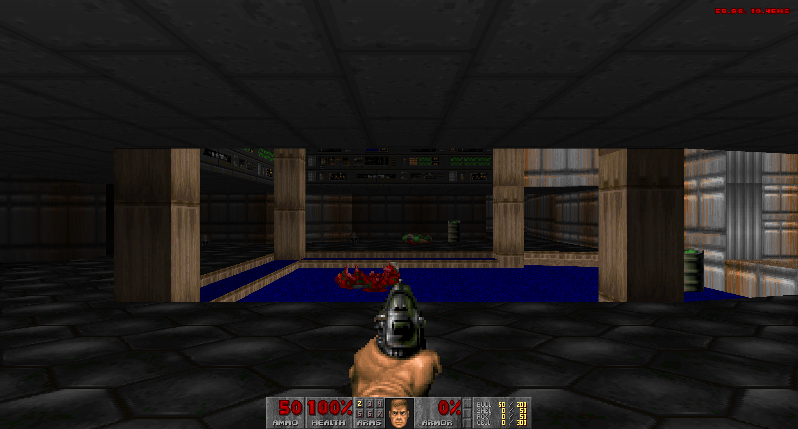
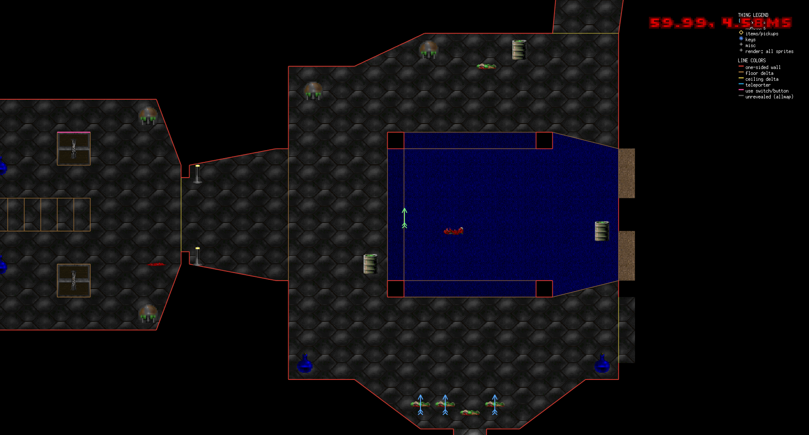

# GD-DOOM

[](https://github.com/Distortions81/GD-DOOM/actions/workflows/ci.yml)
[](https://github.com/Distortions81/GD-DOOM/actions/workflows/govulncheck.yml)
[](https://goreportcard.com/report/github.com/Distortions81/GD-DOOM)
[](https://github.com/Distortions81/GD-DOOM/blob/main/LICENSE)

<p align="center">
  
  <br>
  Source Port mode shown above, 3840x2160 [4k].
  
  <br>
  Browser build: <a href="https://m45sci.xyz/u/dist/GD-DOOM">https://m45sci.xyz/u/dist/GD-DOOM</a>
</p>

GD-DOOM is a Doom engine and source port for original Doom data. It runs as a native desktop app and as a browser build, loads base game WADs and add-on/mod WADs, can play or record classic Doom v1.10 demos, and can host live watch/chat/voice sessions.

It currently exposes two presentation styles:

- `Faithful` mode stays closer to classic DOS Doom behavior and presentation.
- `Source Port` mode enables smoother camera motion, higher-fidelity rendering and more.

In practice, `Faithful` mode is the stricter compatibility-oriented presentation path, while `Source Port` mode is the quality-of-life path with smoother view interpolation, richer rendering defaults, and a more modern feel during desktop play.

GD-DOOM is distributed under GNU GPL v2. It is inspired by, ported from, and derivative of id Software's DOOM source release. See [LICENSE](/home/dist/github/GD-DOOM/LICENSE) and [NOTICE](/home/dist/github/GD-DOOM/NOTICE).

## Compared With Vanilla Doom

Note: Not all featutures are exposed in the UI, some are still experimental.

GD-DOOM still uses original Doom WAD data and Doom-style game logic, but the actual play experience is broader than vanilla DOS Doom. The biggest differences are:

- Two ways to play: `Faithful` mode aims for a more classic look and feel, while `Source Port` mode is smoother, cleaner, and more modern on a desktop monitor.
- Smoother motion: movement, turning, and monster motion are smoothed between Doom tics, so the game does not look like it is stepping from frame to frame.
- Richer presentation: the picture is presented in full color, the HUD and automap scale more cleanly, and optional effects like CRT filtering and smoother animated transitions are available.
- Better map reading: the automap presentation is cleaner on modern displays and adds rotate mode on top of the classic map features.
- Better controls: mouse look is built in, bindings are more flexible, and there are separate in-game screens for voice and key setup.
- Extra demo tooling: beyond classic demo playback and recording, GD-DOOM can also write detailed tick-by-tick state logs for troubleshooting.
- Live session features: one machine can broadcast a run while others watch in real time, chat, and optionally listen or talk over voice.
- Detailed voice controls: microphone streaming includes codec choices, sample-rate control, automatic gain control, a noise gate, push-to-talk, and an in-game input meter.
- Modern music playback choices: on current platforms you can choose between a built-in FM-synth style soundtrack and a SoundFont-based MIDI path.
- Detailed PC speaker emulation: on current platforms, `-pc-speaker` recreates the harsh, buzzy PC speaker sound of old DOS machines through a dedicated emulation path that pays attention to timing, pitch behavior, speaker response, and the metallic ring of a small PC case.
- Linux hardware PC speaker output: on Linux, `-pc-speaker-hw` drives the real `/dev/input/by-path/…pcspkr` device directly — no audio card involved, just the actual buzzer on the motherboard.
- Analog touch controls: the browser and mobile build includes a dual-pad touch layout with analog joystick input — left pad for movement and strafe, right pad for turning, with fire/use activation at the outer edges of each pad and a thumb indicator showing current deflection.
- Episode finales: the Doom episode end sequences (text crawl + cast screen + bunny screen) play correctly after completing an episode.
- Peer co-op multiplayer: lockstep co-op over the GDSF relay, with per-tic input sync, roster management, and automatic desync detection via periodic state checksums.
- Browser play: the same project also has a playable browser version with local WAD loading.

### Rendering

- `Faithful` and `Source Port` runtime modes.
- Full-color rendering instead of the original palette-limited screen presentation.
- Higher-resolution presentation for walls, sprites, HUD, and automap.
- Smoothed camera movement, turning, and thing motion between Doom tics.
- Smoother texture changes, weapon transitions, and broader multi-frame sprite animation.
- Integrated automap with follow mode, rotate mode, big-map view, grid, and map marks.

The game still runs on Doom-style simulation and classic map data. The extra work here is mostly presentation work: cleaner output, smoother motion, more readable UI, and optional visual polish that makes the game feel better on modern screens.

### Audio

- `impsynth` for a built-in FM-synth style closer to classic Doom hardware.
- `meltysynth` for SoundFont-based MIDI playback.
- Optional PC speaker sound effects via `-pc-speaker`.
- Linux hardware PC speaker output via `-pc-speaker-hw` using the real buzzer device.
- Separate music and SFX volume controls.
- Stereo music playback with adjustable width.
- In-game music menu and browser music flow.
- Live voice capture with selectable codec, automatic gain control, noise gate, and push-to-talk support.

If you just want the short version:

- `impsynth` sounds more like classic FM-synth Doom.
- `meltysynth` is the choice if you want a different MIDI playback character, similar in spirit to choosing a different MIDI device or synth, through SoundFont-based playback.

`-pc-speaker` is also more than a novelty toggle. It is meant to sound like the real old PC speaker path: brittle attack, buzzy tone, timer-driven pitch behavior, and the cramped metallic character of sound coming from a tiny speaker inside a beige box. On Linux, `-pc-speaker-hw` goes a step further and routes output to the actual hardware buzzer (`/dev/input/by-path/…pcspkr`) — no audio card or sample mixing involved.

### Runtime

- Direct loading of base game WADs and add-on/mod WADs.
- Automatic game selection when one known base WAD is present.
- In-game WAD picker when multiple supported base games are available.
- Save/load support integrated into normal play.
- Demo playback, demo recording, and optional tick-by-tick state export.
- Live broadcast/watch sessions with text chat and optional microphone voice streaming.
- In-game sound, voice, and key binding menus plus persisted native config through `config.toml`.

Startup options mainly decide what kind of session you want to run: what game data to load, what map to start on, whether you are playing, watching, broadcasting, or recording a demo. Once you are in the game, the menus take over for the settings most people want to tweak during play.

## Requirements

- Go `1.26.1` or newer
- A Doom game WAD such as `DOOM.WAD`, `DOOM1.WAD`, `DOOM2.WAD`, `TNT.WAD`, or `PLUTONIA.WAD`

On Linux, native builds also need the usual Ebiten desktop dependencies for X11, OpenGL, and audio.

## Quick Start

Run from the repository root:

```bash
go run . -wad DOOM1.WAD
```

The dedicated desktop entrypoint is equivalent:

```bash
go run ./cmd/gddoom -wad DOOM1.WAD
```

You can also pass the base game WAD as the first positional argument:

```bash
go run . DOOM1.WAD
```

Add-on/mod WADs are comma-separated:

```bash
go run . -wad DOOM2.WAD -file mods/nerve.wad,mods/examplepatch.wad
```

If `-wad` is omitted and the working directory contains one known game WAD, GD-DOOM uses it automatically. If multiple supported game WADs are present, the runtime can open an in-game picker.

`-file` add-ons are layered on top of the chosen base game. If you want demo playback, watching, or live sessions to match correctly, every machine should use the same base game and the same mod files.

## Common Options

Print all flags:

```bash
go run . -help
```

Frequently used options:

- `-sourceport-mode` starts in the smoother, higher-fidelity Source Port profile.
- `-pc-speaker` switches sound effects to the PC speaker emulation path.
- `-pc-speaker-hw` (Linux only) routes PC speaker output to the real hardware buzzer device instead of the audio card.
- `-music-backend=auto|impsynth|meltysynth` selects the music style/engine.
- `-soundfont=PATH` selects an external `.sf2` file for `meltysynth`.
- `-detail-level=N` sets starting image detail and `-auto-detail` tries to keep the game near 60 FPS automatically.
- `-crt-effect`, `-gpu-sky`, and `-texture-anim-crossfade-frames=N` enable extra visual polish in Source Port mode.
- `-map=E1M1` or `-map=MAP01` starts on a specific map.
- `-record-demo=out.lmp` records a Doom v1.10 demo from live play.
- `-demo=path/to/demo.lmp` plays back a Doom v1.10 demo and exits when playback ends.
- `-trace-demo-state=path.jsonl` writes a detailed tick-by-tick state log during demo playback.
- `-broadcast[=ADDR]` starts a live session for watchers, defaulting to `127.0.0.1:6670`.
- `-watch[=ADDR] -watch-session=N` joins a relay session as a viewer.
- `-low-latency` trades some efficiency for faster live delivery.
- `-mic` sends microphone audio while broadcasting.
- `-mic-codec=silk|g726|pcm` selects the voice codec used for microphone streaming.
- `-config=config.toml` reads and persists native runtime settings.
- `-dump-music` saves the game's music tracks as WAV files.
  Note: the main app dump path currently exports the built-in OPL/SoundFont renderers, while `cmd/musicwav` and `scripts/dump_music.sh` support direct PC speaker WAV export modes.

There are more flags than the short list above. Use `go run . -help` for the full set if you want every tweak and debug option.

Examples:

```bash
go run . -wad DOOM1.WAD -sourceport-mode
go run . -wad DOOM1.WAD -pc-speaker
go run . -wad DOOM1.WAD -music-backend=impsynth
go run . -wad DOOM1.WAD -music-backend=meltysynth -soundfont=./soundfonts/general-midi.sf2
go run . -wad DOOM1.WAD -detail-level=2 -auto-detail
go run . -wad DOOM2.WAD -map=MAP01 -record-demo=output.lmp
go run . -wad DOOM1.WAD -demo=demos/DOOM1-DEMO1.lmp
go run . -wad DOOM1.WAD -dump-music
go run ./cmd/musicwav -doom2 DOOM2.WAD -song D_RUNNIN -mode pcspeaker-clean -out ./out/music-pcspeaker-clean
go run . -wad DOOM1.WAD -broadcast
go run . -wad DOOM1.WAD -broadcast -mic -mic-codec=silk
go run . -wad DOOM1.WAD -watch -watch-session=1
go run . -wad DOOM1.WAD -cheat-level=3
go run . -wad DOOM1.WAD -all-cheats
```

## Relay Watch / Voice

Run the relay server:

```bash
go run ./cmd/gdsfrelay
```

Broadcast a session to the default local relay:

```bash
go run . -wad DOOM1.WAD -broadcast
```

The broadcaster prints the assigned session id on startup. View from another instance using the same base game and mod files:

```bash
go run . -wad DOOM1.WAD -watch -watch-session=1
```

Optional voice broadcast is available on native Linux builds through PulseAudio capture:

```bash
go run . -wad DOOM1.WAD -broadcast -mic
go run . -wad DOOM1.WAD -broadcast -mic -mic-codec=silk
```

Notes:

- `-broadcast` and `-watch` are mutually exclusive.
- `-watch` also connects to the paired relay audio stream automatically.
- Watchers can also participate in session chat.
- `-low-latency` favors quicker delivery over more batching.
- Current microphone codecs are `silk`, `g726`, and `pcm`.
- The wire format is documented in [`netplay-protocol.md`](/home/dist/github/GD-DOOM/netplay-protocol.md).

This is closer to live spectating than traditional network co-op. One machine plays, the others watch the run as it happens, and chat and voice ride alongside that live stream.

## Co-op Multiplayer

GD-DOOM also supports peer co-op play over the same GDSF relay used for watch sessions. Co-op runs the game in lockstep: every player sends their input tics to the relay each frame, and the sim only advances once all peers have checked in for that tic.

Connect as a co-op peer:

```bash
go run . -wad DOOM.WAD -coop -watch-session=1
```

The canonical peer (slot 1 / the session host) emits a state checksum roughly every 5 seconds. All other peers verify the hash and automatically request a keyframe resync from the server if their local state has drifted. The checksum covers RNG state, all player positions and stats, moving sector heights, and active monster states, so most forms of desync are caught quickly.

Notes:

- All peers must use the same base WAD and mod files, same as watch sessions.
- The co-op session uses the same relay server as `-broadcast`/`-watch` — run `go run ./cmd/gdsfrelay` first.
- Session slot assignment follows the same scheme as watch sessions; the host is slot 1.

## Cheats

Startup cheats:

- `-cheat-level=1` enables full automap reveal with `IDDT 2`.
- `-cheat-level=2` applies the above plus `IDFA`.
- `-cheat-level=3` applies the above plus `IDKFA` and invulnerability.
- `-invuln` starts with invulnerability enabled.
- `-all-cheats` is the alias for full startup cheats.

Typed in-game cheats:

- `iddqd` toggles invulnerability.
- `idfa` grants weapons, ammo, and armor.
- `idkfa` grants weapons, ammo, armor, and keys.
- `iddt` cycles automap reveal and thing display states.
- `idclip` toggles no-clip.
- `idspispopd` also toggles no-clip.
- `idmypos` prints the current player angle and coordinates.
- `idchoppers` grants chainsaw + invulnerability tick behavior matching classic Doom.
- `idclev##` warps to a map such as `idclev11` or `idclev23`.
- `idmus##` changes music when the current WAD supports that track selection.
- `idbehold` shows the power-up cheat prompt.
- `idbeholdv`, `idbeholds`, `idbeholdi`, `idbeholdr`, `idbeholda`, and `idbeholdl` toggle the matching power-up effect.

## Controls

Default desktop controls are:

- Menus: `Arrow Keys` + `Enter`, `Esc` to go back.
- Game: `WASD` or arrow keys to move, mouse to turn.
- Fire: `Ctrl` or left mouse button.
- Use / open: `E` or `Space`.
- Run modifier: `Shift`.
- Strafe modifier: `Alt`.
- Automap: `Tab`.
- Chat: `T`.
- Push to talk: `Caps Lock`.
- Weapon next / previous: `Page Down` / `Page Up` or mouse buttons `MB5` / `MB4`.
- Help: `F1`.

Bindings can be changed in the frontend and pause-menu keybind screens, and persisted under the `keybinds` table in `config.toml`.

There are additional runtime shortcuts for features like detail level, gamma, screenshots, and automap behavior.

## Menus And Config

The frontend and pause menus expose most of the settings people actually want to change while playing:

- Sound options for SFX/music volume.
- Voice options for codec, sample rate, automatic gain control, gate strength, device selection, and push-to-talk.
- Key binding menus with primary/alternate bindings and reset-to-default support.
- Persisted native settings through `config.toml`, including runtime options and the `keybinds` table.

`config.toml` is the desktop settings file. GD-DOOM reads it at startup, uses it as the default configuration, and writes new values back when you change settings or bindings in-game. You can ignore it and use the menus, or edit it by hand if you prefer.

A representative config can include entries such as:

```toml
detail_level_faithful = 0
detail_level_sourceport = 0
auto_detail = false
gamma_level = 2
mouselook = true
music_backend = "meltysynth"
soundfont = "soundfonts/general-midi.sf2"

[keybinds]
move_forward = ["W", "UP"]
chat = ["T", ""]
voice = ["CAPSLOCK", ""]
use = ["SPACE", "E"]
```

## Browser Build

GD-DOOM also has a browser version. To build it locally:

```bash
./scripts/build_wasm.sh
```

The script writes output to `build/wasm`, copies the web assets, and produces `gddoom.wasm.gz`. It requires:

- `DOOM1.WAD` at the repository root
- `wasm_exec.js` from your local Go toolchain
- optional `wasm-opt` on `PATH` for automatic optimization

Serve the generated app:

```bash
go run ./cmd/wasmserve
```

By default `cmd/wasmserve` serves the current directory if it already contains the built app; otherwise it falls back to `build/wasm` and listens on `:8000`.

You can also serve a specific output directory:

```bash
go run ./cmd/wasmserve -dir build/wasm -addr :8000
```

The browser UI can load user-selected WAD files locally from your machine.

Browser builds can also download and cache SoundFonts for `meltysynth`, so the web player is not limited to one hardwired music setup.

The browser build is meant to be genuinely playable, not just a minimal demo. It shares most of the same runtime code, but a few features are still platform-specific, especially around local microphone capture.

On touch devices the browser build shows a dual-pad on-screen layout: the left pad controls forward/back movement and strafing, the right pad handles turning. Both pads use analog joystick input — deflection scales continuously from zero to full speed rather than snapping to fixed speeds. Fire and use activate only when your thumb reaches the outer edge of the respective pad, which keeps accidental shots from killing accidental strafes. A small indicator follows your thumb to show current deflection.

## Development

Run the test suite:

```bash
go test ./...
```

If you are working on the engine itself, extra utilities are included under [`cmd/`](/home/dist/github/GD-DOOM/cmd):

- [`cmd/gdsfrelay`](/home/dist/github/GD-DOOM/cmd/gdsfrelay) runs the live session relay used by `-broadcast` and `-watch`.
- [`cmd/wasmserve`](/home/dist/github/GD-DOOM/cmd/wasmserve) serves the browser build locally.
- [`cmd/demotracecmp`](/home/dist/github/GD-DOOM/cmd/demotracecmp) compares two demo state logs to help find mismatches or desyncs.
- [`cmd/musicwav`](/home/dist/github/GD-DOOM/cmd/musicwav) exports in-game music tracks to WAV files, including `impsynth`, `pcspeaker`, `pcspeaker-clean`, and `pcspeaker-piezo` modes with optional single-song selection via `-song`.
- [`cmd/pcspeaker`](/home/dist/github/GD-DOOM/cmd/pcspeaker) captures live PC speaker output, interleaves music and SFX streams, and can drive the Linux hardware buzzer directly for testing.
- [`cmd/mapprobe`](/home/dist/github/GD-DOOM/cmd/mapprobe) inspects map data such as sectors, lines, tags, and things.
- [`cmd/mapaudit`](/home/dist/github/GD-DOOM/cmd/mapaudit) generates a report about oddities in local Doom map data.
- [`cmd/wadtool`](/home/dist/github/GD-DOOM/cmd/wadtool) extracts individual files from WADs.

These tools are mostly for development, testing, and troubleshooting rather than normal play.

## Advanced Diagnostics

These optional environment variables are mainly useful if you are troubleshooting voice or live-session behavior. Any non-empty value enables the feature.

- `GD_DOOM_NET_BANDWIDTH_OVERLAY` shows the in-game network bandwidth overlay.
- `GD_DOOM_VOICE_SYNC_OVERLAY` adds the voice sync offset to the bandwidth overlay when voice sync data is available.
- `GD_DOOM_VOICE_AGC_LOG` prints occasional automatic gain control diagnostics while broadcasting voice.

Examples:

```bash
GD_DOOM_NET_BANDWIDTH_OVERLAY=1 go run . -wad DOOM1.WAD
GD_DOOM_NET_BANDWIDTH_OVERLAY=1 GD_DOOM_VOICE_SYNC_OVERLAY=1 go run . -wad DOOM1.WAD
GD_DOOM_VOICE_AGC_LOG=1 go run . -wad DOOM1.WAD
```

Voice runtime notes:

- If the viewer has to skip ahead to catch live audio back up, you will see `voice-skip ...` messages in the console.

Useful helper commands and tools live under [`cmd/`](/home/dist/github/GD-DOOM/cmd) and [`scripts/`](/home/dist/github/GD-DOOM/scripts), including utilities for WAD inspection, map analysis, demo tracing, music export, and WASM serving.

Supported commercial Doom-family game/add-on fingerprints tracked by the runtime are documented in [`commercial-wads.md`](/home/dist/github/GD-DOOM/commercial-wads.md).

That file is there for recognition and compatibility lookup. It is not a promise that GD-DOOM fully supports every non-Doom title listed there.

## Status

GD-DOOM is still alpha. It is already playable and covers a broad set of Doom runtime features, but vanilla parity work and edge-case cleanup are still in progress.
