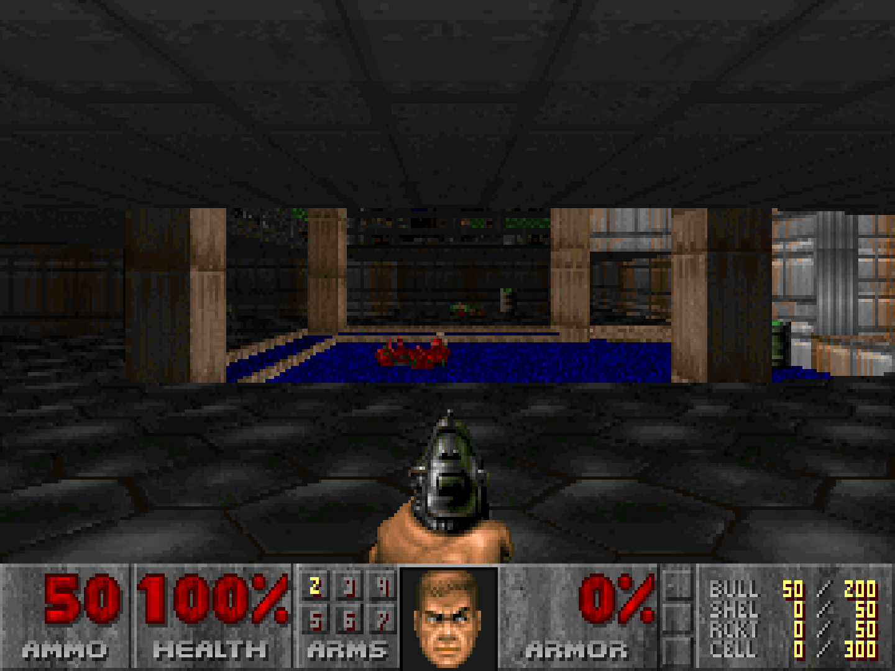
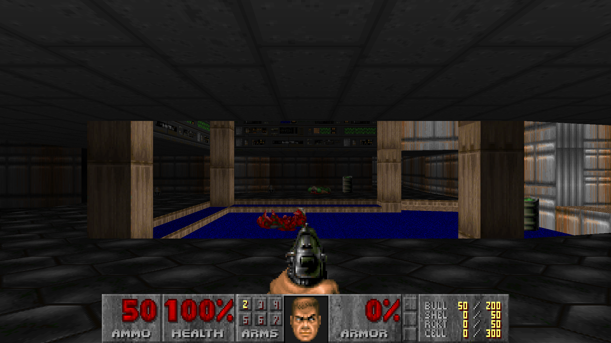
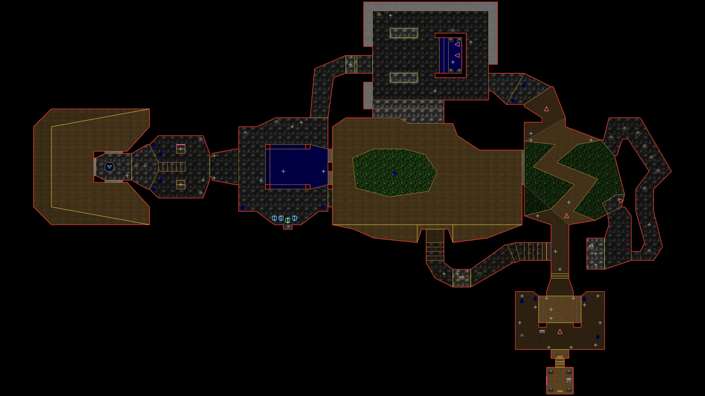
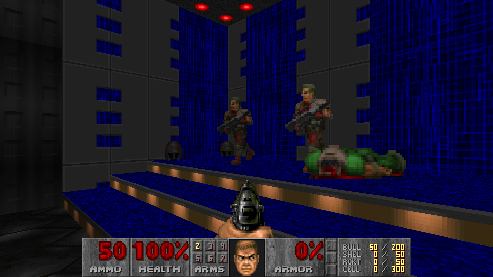
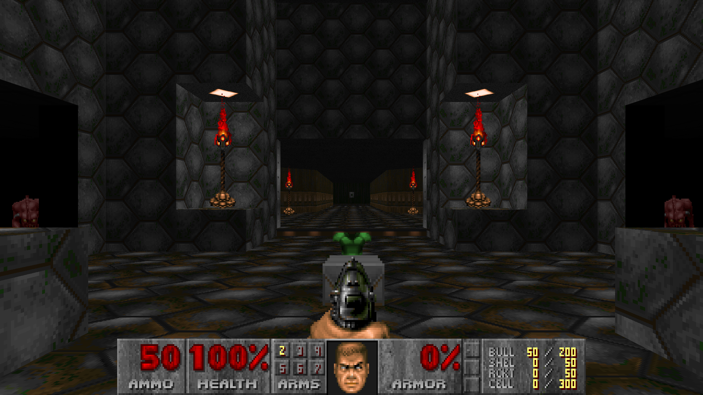
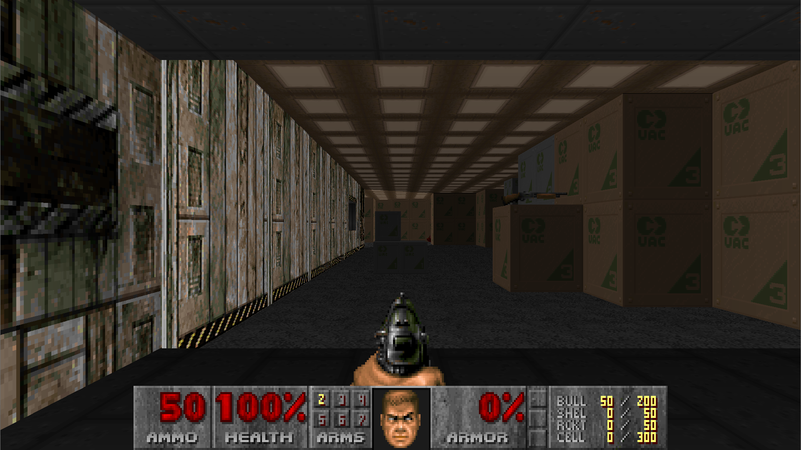
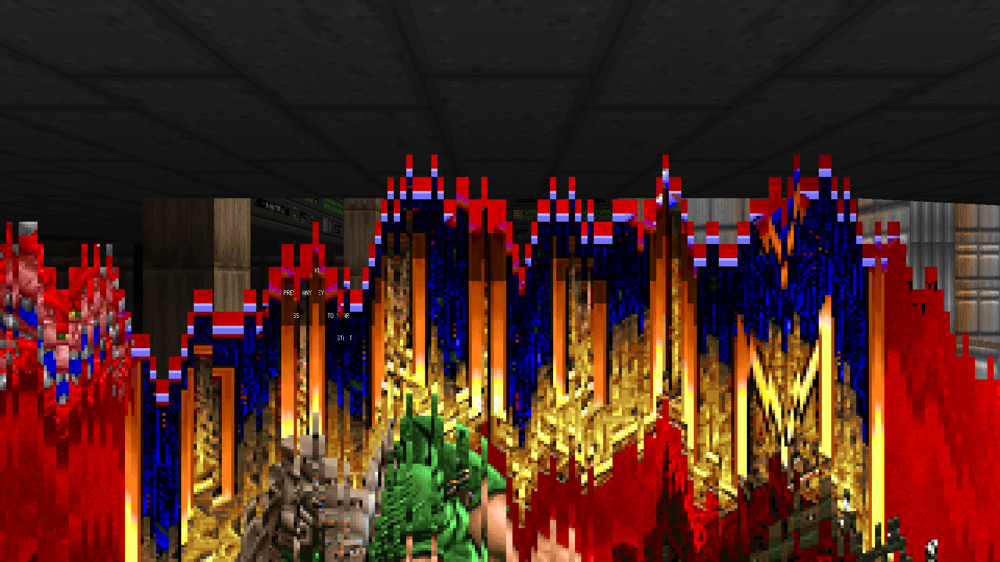
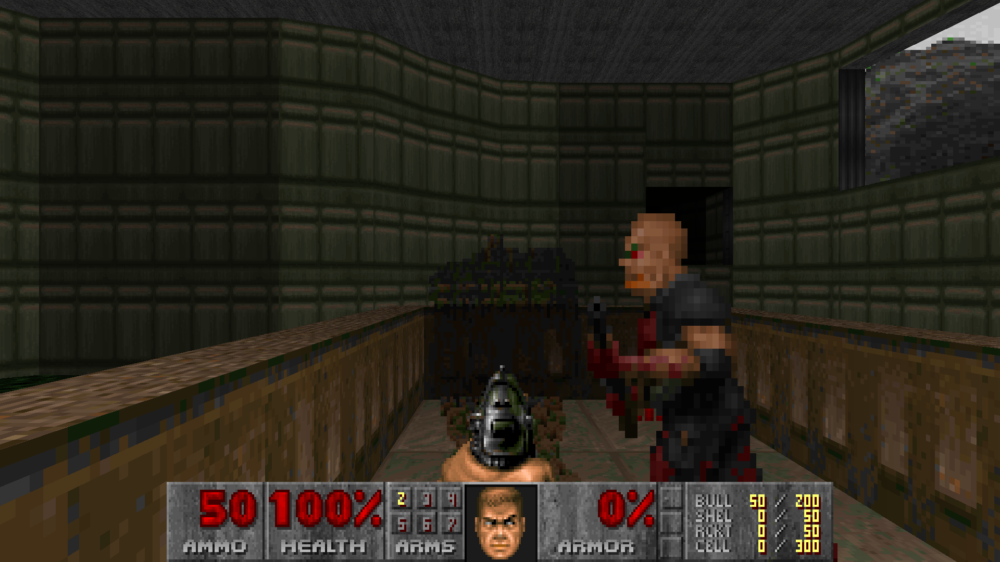
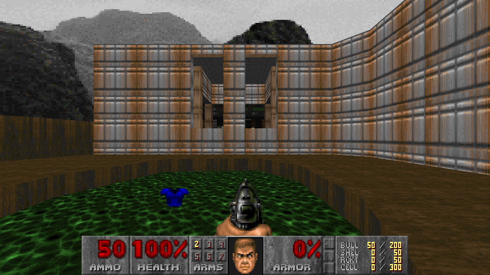

# GD-DOOM

[](https://github.com/Distortions81/GD-DOOM/actions/workflows/ci.yml)
[](https://github.com/Distortions81/GD-DOOM/actions/workflows/govulncheck.yml?query=branch%3Amain+event%3Apush)
[](https://github.com/Distortions81/GD-DOOM/releases/latest)
[](LICENSE)

A Doom engine and source port written in Go, for desktop and browser.
**GPU shaders preserve Doom's software-rendered appearance** while accelerating
pixel drawing in both Faithful and Source Port modes. Play with classic
presentation or smooth modern rendering, choose FM, SoundFont, or PC speaker
audio, and share live sessions with spectators.

**[Play in your browser](https://m45sci.xyz/u/dist/GD-DOOM)** ·
**[Desktop releases](https://github.com/Distortions81/GD-DOOM/releases/latest)**:
[Linux](https://github.com/Distortions81/GD-DOOM/releases/latest/download/GD-DOOM-linux-x86_64.zip) ·
[Windows](https://github.com/Distortions81/GD-DOOM/releases/latest/download/GD-DOOM-windows-x86_64.zip) ·
[macOS Intel](https://github.com/Distortions81/GD-DOOM/releases/latest/download/GD-DOOM-macos-intel.zip) ·
[macOS Apple Silicon](https://github.com/Distortions81/GD-DOOM/releases/latest/download/GD-DOOM-macos-apple-silicon.zip)

## Gallery

Captured with the current GPU renderer. The matching E1M1 views compare
**Faithful** mode's classic 320×200 rendering, 256-color palette, and 4:3
presentation with **Modern (Source Port)** mode's full-color lighting and crisp
texture detail at 1920×1080. Click a screenshot to open the full-size image.

<table>
  <tr>
    <td width="33%" align="center" valign="top"><a href="https://raw.githubusercontent.com/Distortions81/GD-DOOM/refs/heads/main/screenshots/faithful.png"></a><br>Faithful · classic presentation</td>
    <td width="33%" align="center" valign="top"><a href="https://raw.githubusercontent.com/Distortions81/GD-DOOM/refs/heads/main/screenshots/e1m1.png"></a><br>Modern · 1080p detail</td>
    <td width="33%" align="center" valign="top"><a href="https://raw.githubusercontent.com/Distortions81/GD-DOOM/refs/heads/main/screenshots/e1m1-map.png"></a><br>Modern · textured automap</td>
  </tr>
  <tr>
    <td align="center" valign="top"><a href="https://raw.githubusercontent.com/Distortions81/GD-DOOM/refs/heads/main/screenshots/level2.png"></a><br>Modern · combat</td>
    <td align="center" valign="top"><a href="https://raw.githubusercontent.com/Distortions81/GD-DOOM/refs/heads/main/screenshots/level3.png"></a><br>Modern · sector lighting</td>
    <td align="center" valign="top"><a href="https://raw.githubusercontent.com/Distortions81/GD-DOOM/refs/heads/main/screenshots/level4.png"></a><br>Modern · interior textures</td>
  </tr>
  <tr>
    <td align="center" valign="top"><a href="https://raw.githubusercontent.com/Distortions81/GD-DOOM/refs/heads/main/screenshots/melt-hq.png"></a><br>Modern · New Game melt</td>
    <td align="center" valign="top"><a href="https://raw.githubusercontent.com/Distortions81/GD-DOOM/refs/heads/main/screenshots/invis.png"></a><br>Modern · spectre fuzz</td>
    <td align="center" valign="top"><a href="https://raw.githubusercontent.com/Distortions81/GD-DOOM/refs/heads/main/screenshots/level.png"></a><br>Modern · outdoor detail</td>
  </tr>
</table>

Videos: [SoundFont demo](https://youtu.be/ID52vj9WQ8A) ·
[OPL/AdLib gameplay](https://youtu.be/tkc6Z8xcjzs) ·
[Software renderer in slow motion](https://youtu.be/aINCe9459-U) ·
[PC speaker simulation](https://youtu.be/vT9SldgjbeA).
Music playlists: [SGM MIDI](https://www.youtube.com/playlist?list=PLMxxYNFZPBOgQWuzTKGScjD2tF3SUfeFD) ·
[OPL/AdLib FM](https://www.youtube.com/playlist?list=PLMxxYNFZPBOh-2qK8iihIQkbcgwXgBegD).

## Software-rendered appearance, GPU drawing

GD-DOOM's shaders keep Doom's crisp texture pixels, column-and-span geometry,
sprite cutouts, clipping, and lighting. The CPU makes the same visibility and
projection decisions as the software renderer; the GPU draws the resulting
columns, spans, and sprite rectangles from indexed texture atlases. This keeps
the familiar software-rendered appearance on desktop and in the browser.

**Faithful** mode keeps the classic Doom presentation and 256-color palette,
using the WAD's **COLORMAP lookup tables** for lighting and the selected gamma
palette for color. Sky coordinates match the CPU renderer, and classic low
detail still doubles each framebuffer column.
**Source Port** mode adds high-resolution output, interpolated camera, monster
and weapon motion, full-color rendering, and optional CRT effects.

Repeated columns and sprite rows share compact draw commands, and nearby
sprites reuse horizontal visibility spans until clipping changes. These reduce
CPU raster preparation and the geometry sent to the GPU, including the work
that previously caused stalls when standing close to enemies.

GPU drawing is **enabled by default in both modes**, with automatic CPU fallback
for unsupported texture banks. Use `-gpu-renderer=false` to select the software
renderer. Framebuffer comparisons cover Doom and Doom II, close-up sprites,
gamma, invulnerability, and faithful high/low detail. Small texture-boundary
rounding differences remain. Spectre fuzz keeps its 320×200 grain at every
resolution, using classic column order, neighbor feedback, and COLORMAP row six.
Spectres draw between sprites and masked textures in depth order, so nearer
enemies stay sharp. Feedback interrupted by clipping remains approximate.
See the [visual checks and measured
performance](docs/gpu-renderer-performance.md) for results and reproduction.

```bash
# Faithful palette and classic presentation, drawn by GPU shaders.
go run . -wad DOOM1.WAD -sourceport-mode=false

# Compare the same scene with the CPU software renderer.
go run . -wad DOOM1.WAD -sourceport-mode=false -gpu-renderer=false
```

## Gameplay and features

- Mouse look, configurable bindings, improved automap, and browser touch controls.
- Saves, quicksave, classic demo playback/recording, and per-tic trace export.
- Base game WADs and layered add-ons; local WAD loading and browser saves.
- Live broadcast/watch sessions, spectator chat, and optional voice.

## Music and sound

Choose music and sound effects separately in the frontend, or use launch flags.

| Music choice | Sound and selection |
| --- | --- |
| **OPL / AdLib FM** | Default classic AdLib/Sound Blaster-era music, using an OPL2-style synth and the WAD's `GENMIDI` instruments. `-music-backend=impsynth` |
| **General MIDI** | Sample-based music through MeltySynth; `general-midi.sf2` is included in desktop releases and embedded in the browser build. |
| **SC55-HQ** | Alternative SoundFont for an SC-55-style MIDI presentation; available on demand from the frontend. |
| **SGM Ultra HQ** | Richer SoundFont option, shown as `SGM-ULTRA-HQ` in the frontend and downloaded on demand as `SGM-HQ.sf2`. |
| **PC speaker music** | An extra beeper arrangement of Doom's music, beyond the original game's sound-effects-only PC speaker option. `-music-backend=pcspeaker` |

For SoundFont music, use `-music-backend=meltysynth -soundfont=PATH.sf2`.
You can also supply your own compatible `.sf2` file; browser SoundFonts are
cached after loading.

**Sound effects:** choose the original digital Sound Blaster-style effects or
`-pc-speaker` for Doom's PC speaker effects. The default `paper-speaker` model
uses a **physical speaker simulation**: original PIT tone timing drives a
model of cone motion, mass, spring response, damping, acoustic filtering, and
steel-case resonance/reverberation for a faithful old-PC sound. A resonant
`small-buzzer` model and direct `passthrough` beeps are also available.
PC speaker music and effects can share the same simulated speaker through
time interleaving.

```bash
# PC speaker effects and music through the physical paper-speaker model.
go run . -wad DOOM1.WAD -pc-speaker -music-backend=pcspeaker \
  -pc-speaker-variant=paper-speaker

# SoundFont music with the usual digital effects.
go run . -wad DOOM1.WAD -music-backend=meltysynth \
  -soundfont=soundfonts/general-midi.sf2
```

On Linux, `-pc-speaker-output=linux` can drive a real PC speaker through the
`pcspkr` evdev device, with write permission to that device. Music and effects
have separate volume controls. Use `-dump-music` for FM/SoundFont WAV exports
or [cmd/musicwav](cmd/musicwav) for FM/PC speaker renders; see the
[usage guide](docs/usage.md).

## Original Doom demo compatibility

The completed COMPET-N sweep covers **4,646 single-player Ultimate Doom and
Doom II recordings** across all 68 starting maps. Verified **2026-10-02**
against the gameplay source shipped in **v0.1.1**:

| Outcome | Recordings |
| --- | ---: |
| Strict state and gameplay RNG match | 4,621 |
| Semantic state and gameplay RNG match only | 7 |
| Documented exclusions | 18 |
| Pending or unexplained failures | 0 |

**99.61% pass; 99.46% match strictly.** Every pass includes an independent
per-tic gameplay RNG audit through original termination or first player death,
including the death tic. The opt-in semantic policy ignores only an unused
field on downward `lowerAndCrush` ceilings and retains raw strict mismatches.
The eighteen exclusions count in the denominator and comprise seventeen
original-reference crashes and one door using uninitialized memory.

[Compatibility guide](demos/COMPET-N.md) ·
[Per-recording results](demos/COMPET-N-results.json) ·
[Exclusions](demos/COMPET-N-exclusions.md) ·
[Desync investigation](desync-work.md)

## Quick start

Desktop releases include the shareware `DOOM1.WAD` and a General MIDI SoundFont.
Supply your own commercial WAD for the full games. From a source checkout:

```bash
go run . -wad DOOM1.WAD
go run . -wad DOOM2.WAD -sourceport-mode
go run . -wad DOOM2.WAD -file mods/nerve.wad,mods/examplepatch.wad
```

The WAD can also be the first positional argument. Without `-wad`, one known
WAD in the working directory is selected automatically; multiple supported
WADs can open the frontend picker. For demos and live sessions, use matching
base WADs and add-ons on every instance.

Source builds require **Go 1.26.6 or newer** and a Doom WAD. Linux also needs
the usual X11, OpenGL, and audio development dependencies. On Debian/Ubuntu:

```bash
sudo apt install -y build-essential pkg-config libasound2-dev libpulse-dev \
  libx11-dev libxcursor-dev libxinerama-dev libxrandr-dev libxi-dev \
  libgl1-mesa-dev libxxf86vm-dev
```

Use `go run . -help` for every flag. Common options include `-map=MAP01`,
`-demo=FILE.lmp`, `-record-demo=FILE.lmp`, `-config=config.toml`, and
`-gpu-renderer=false`. Settings and key bindings can be changed in the menus
and saved to `config.toml`.

## Controls and live sessions

Move with **WASD** or arrows, turn with the mouse, fire with **Ctrl** or left
mouse, use with **E/Space**, run with **Shift**, and open the automap with **Tab**.
Use **Esc** for menus, **T** for chat, and **Caps Lock** for push to talk.
Bindings are configurable.

Run `go run ./cmd/gdsfrelay`, then start a game with `-broadcast`. Join from
another instance with `-watch -watch-session=N`, using the session ID printed
by the broadcaster. Native Linux microphone capture is available with `-mic`.
See the [relay, voice, controls, and cheats reference](docs/usage.md).

## Browser and development

Build and serve the browser version from the repository root:

```bash
./scripts/build_wasm.sh
go run ./cmd/wasmserve
```

The build uses `DOOM1.WAD` and your Go toolchain's `wasm_exec.js`; optional
`wasm-opt` optimizes the output. The browser supports local WAD loading,
SoundFont caching, touch controls, and persistent saves. Click or tap once to
start audio where browser autoplay policies require it.
Browser rendering uses VSync by default, with no separate WASM frame throttle.

```bash
go test ./...
scripts/test_integration.sh ./internal/app
```

More options, configuration examples, export tools, and diagnostics are in
[Usage and development](docs/usage.md). See [commercial WAD fingerprints](commercial-wads.md),
[netplay protocol](netplay-protocol.md), and [vector-rendering visibility notes](docs/vector-rendering-visibility.md)
for technical references.

GD-DOOM is still alpha. It is derived from id Software's Doom source release
and distributed under **GNU GPL v2**; see [LICENSE](LICENSE) and [NOTICE](NOTICE).
