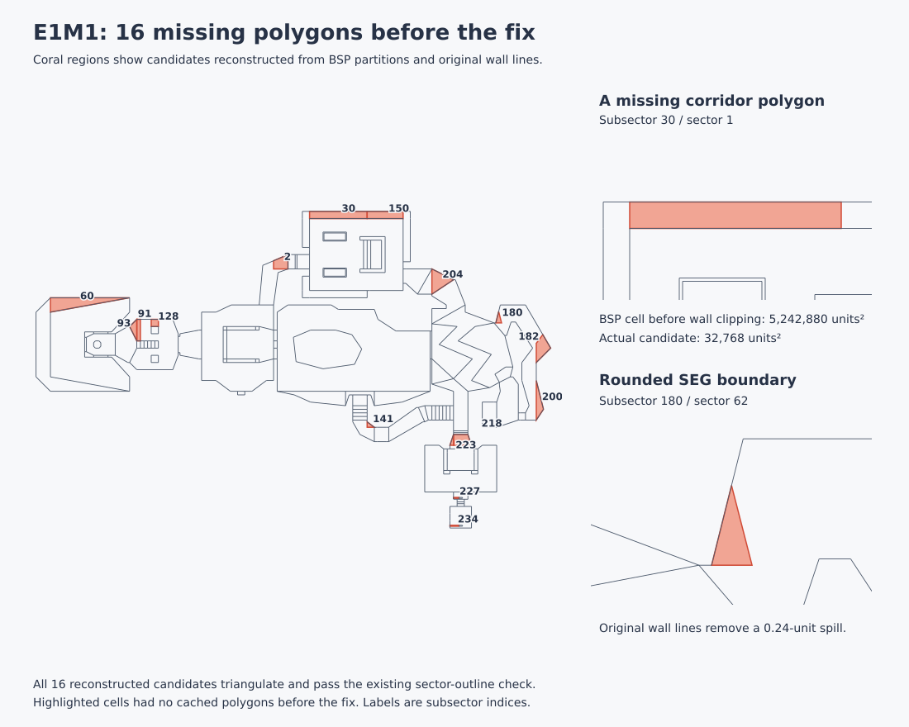

# Level triangulation investigation

Investigated and fixed on October 3, 2026. Short BSP leaves are now clipped to
their original wall lines before bounding-box overlap rejection. This restores
previously missing cached polygons without changing the gameplay renderer.

## Existing geometry

`internal/doomruntime/game.go` already reconstructs subsector polygons, performs
ear clipping and quad splits, recovers some BSP leaves, and caches sector
triangles. The constrained triangulation entry points in
`internal/doomruntime/triangulate_cdt.go` are stubs.

These caches are not a complete 3D level mesh. The current textured automap
rasterizes sector rings directly, and the gameplay renderer uses wall columns
and visplane spans. Its GPU draw triangles are screen-space primitives.

## Missing polygons on shareware E1M1

The investigated root `DOOM1.WAD` has 237 E1M1 subsectors and 85 sectors. Sixteen
subsectors had no cached polygon before the fix. All sixteen have one or two SEGs: their
remaining boundaries must be recovered from BSP partitions rather than a
closed SEG loop.



Previously, `constrainAmbiguousNodePolysToSectorBounds` rejected short leaves when the
overlap of their bounding box with the expanded sector bounding box is below
15%. This was evaluated before clipping the BSP cell against its actual walls.
Every missing leaf failed that test. BSP cells can extend far beyond solid walls,
so the ratio does not establish that the bounded, playable polygon is invalid.

For example, subsector 30's raw BSP cell has an area of 5,242,880 square map
units. Wall clipping reduces it to a valid corridor polygon of 32,768 square
map units, but its original bounding-box overlap ratio is only 0.00703.

| Missing subsector | Sector | SEG count | Candidate area, square map units |
| ---: | ---: | ---: | ---: |
| 2 | 2 | 2 | 12,873.14 |
| 30 | 1 | 2 | 32,768.00 |
| 60 | 28 | 2 | 45,056.00 |
| 91 | 24 | 2 | 6,144.00 |
| 93 | 24 | 2 | 6,144.00 |
| 128 | 24 | 2 | 4,096.00 |
| 141 | 16 | 1 | 1,536.00 |
| 150 | 1 | 2 | 20,480.00 |
| 180 | 62 | 1 | 2,584.52 |
| 182 | 62 | 2 | 17,109.33 |
| 200 | 62 | 2 | 11,264.00 |
| 204 | 53 | 2 | 21,504.00 |
| 218 | 73 | 2 | 13,824.00 |
| 223 | 73 | 1 | 1,536.00 |
| 227 | 78 | 2 | 384.00 |
| 234 | 82 | 2 | 640.00 |

Clipping against oriented SEG endpoint lines produces candidates for all sixteen,
but two fail the sector-outline check. Rounded nodebuilder vertices place the
subsector 2 candidate about 0.79 map units outside its original wall, and the
subsector 180 candidate about 0.24 units outside.

Using each SEG's original linedef, oriented by `Direction`, resolves those two
discrepancies. All sixteen resulting candidates triangulate, pass the existing
sector-outline containment check, and have centroids in their expected BSP
leaves. The production fix applies original-linedef clipping during short-leaf
bounding and fallback recovery; subsequent clipping also uses original linedefs
so rounded SEG endpoints cannot reintroduce this discrepancy. These checks do
not establish that the whole level mesh is watertight.

## Recovery order

1. Construct the leaf cell from its ancestor BSP half-planes.
2. Clip it to the front half-plane of each original linedef referenced by its
   SEGs, reversing the line orientation when `Direction` is 1.
3. Validate the bounded polygon, its sector membership, and triangulation.
4. Assess any remaining rejection heuristics against that bounded geometry.

Regression tests cover oversized short cells, reversed wall orientation,
rounded SEG endpoints, and exterior cells. The E1M1 real-map regression checks
that all 104 short leaves have usable polygons and triangles with centroids in
their expected BSP leaves. Full 3D meshing still needs consistent shared
boundaries, holes, floor/ceiling heights, wall surfaces, texture coordinates,
and moving-sector updates.

## Reproduction and validation

The real-map tests search parent directories for a root IWAD, preferring
`DOOMU.WAD` and `DOOM.WAD` over `DOOM1.WAD`. Different IWADs and node builds can
produce different counts. Use the same shareware WAD for the results above.

```sh
xvfb-run -a go test ./internal/doomruntime \
  -run 'TestShortSubsector|TestRealMap_E1M1_ShortLeafPolygonCoverage' -v -count=1

GD_GEOMETRY_WADS="$PWD/DOOM1.WAD,$PWD/wads/DOOMU.WAD,$PWD/wads/DOOM2.WAD" \
  xvfb-run -a go test ./internal/doomruntime \
  -run '^TestRealMaps_SubsectorPolygonCoverageDiagnostics$' -v -count=1

xvfb-run -a go test ./internal/doomruntime \
  -run 'Test(Triangulate|Subsector|BuildSectorLoopSets|ClipSubSector|RealMap_E1M1_.*(Triangulation|TriCache))' \
  -v -count=1

GD_AUTOMAP_STRICT_SECTOR_COVERAGE=1 xvfb-run -a go test ./internal/doomruntime \
  -run '^TestRealMap_E1M1_SectorPlaneTriCoverageVsSectorLoops$' -v -count=1
```

The full Go test suite passes. Shareware E1M1 now has polygons for all 237
subsectors, with zero triangulation failures or area mismatches in the existing
quality test. Comparison with an isolated copy of commit `4d6994e` showed fewer
missing polygons in every one of the 77 audited map variants, with no increase
in missing-polygon counts. The nine shareware maps overlap Ultimate Doom's first
episode and are counted here as separate input variants.

| Input | Maps | Missing before | Missing after |
| --- | ---: | ---: | ---: |
| Shareware Doom | 9 | 94 | 4 |
| Ultimate Doom | 36 | 512 | 173 |
| Doom II | 32 | 281 | 12 |

The Ultimate Doom remainder is concentrated in E4M7 (165 missing polygons,
down from 169); this fix does not solve that map's larger reconstruction problem.

The opt-in strict E1M1 coverage test still fails: the number of sectors outside
its coverage or spill thresholds fell from nineteen to seven. These remaining
mismatches, and missing polygons on some other maps, are separate follow-up
work. Having triangles for every sector is weaker than complete coverage.

See also [vector visibility notes](vector-rendering-visibility.md).
